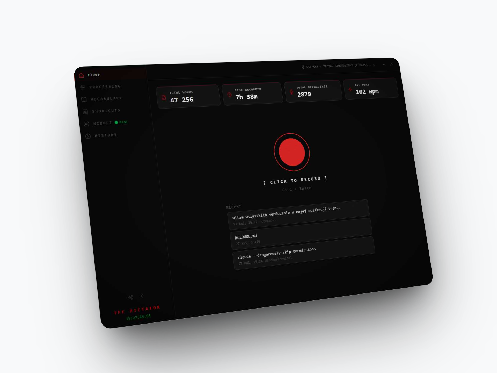
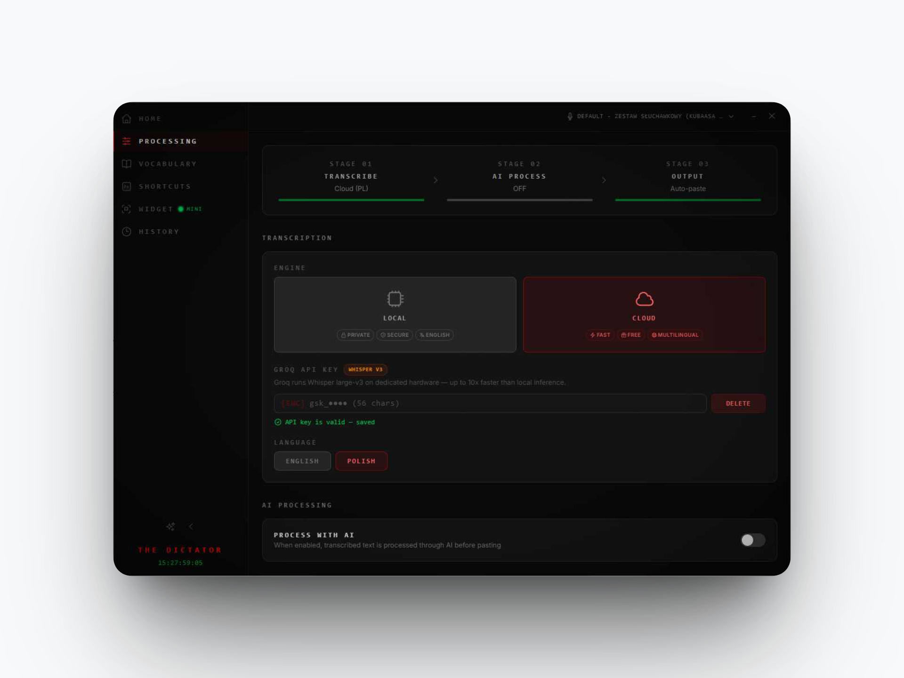
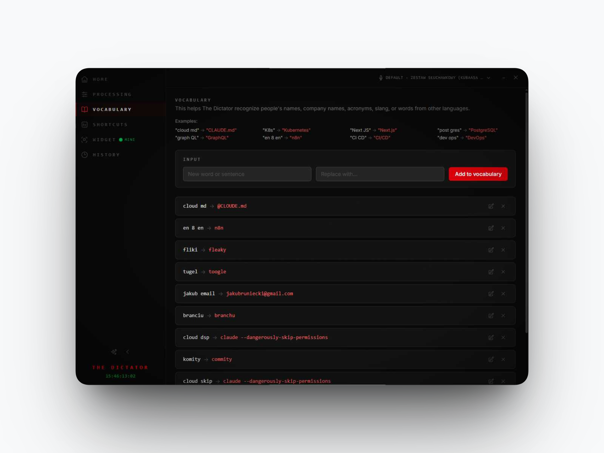
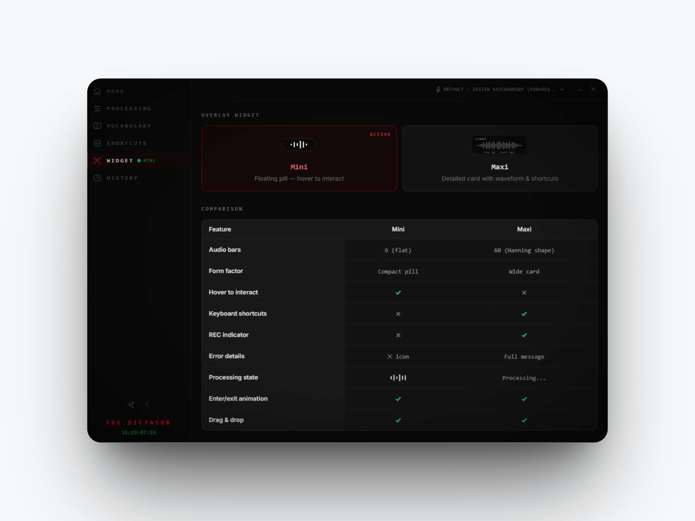
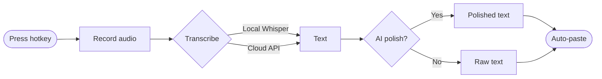
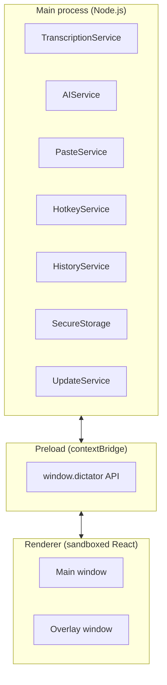
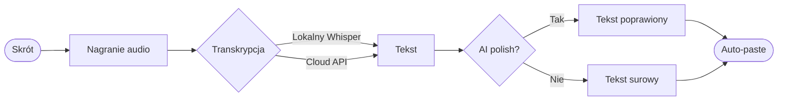

<div align="center">


# The Dictator

**Voice dictation for Windows that actually disappears into your workflow.**

One hotkey → transcribed, polished, pasted<br>
100% offline option (local Whisper)<br>
Works in every app, no integration needed

[](LICENSE)
[](#installation)
[](https://www.electronjs.org/)

</div>



---

## Screenshots

| Modes | Polish AI |
|:---:|:---:|
|  |  |
| **Vocabulary** | **Widget** |
|  |  |

## How It Works



1. **Press your hotkey** (or hold for Push-to-Talk). The Dictator captures your microphone
2. **Speak**. Audio is transcribed locally with Whisper or via cloud API
3. **Optional AI polish**. Your selected prompt cleans up, formats, or restructures the text
4. **The result is typed** straight into whatever window had focus when you started

You don't switch context. You don't copy-paste. You talk, and your text appears.

## Features

**Transcription**
- Offline transcription via local Whisper models (tiny → large-v3), no internet required
- Cloud transcription via OpenAI Whisper API or Groq API
- Automatic model download with progress tracking
- Languages: auto-detect, English, Polish

**AI Post-Processing**
- Create your own AI prompts for any context (emails, chats, notes, code comments). Each prompt is a saved profile with its own system prompt and temperature
- 2 providers: OpenAI (GPT-4.1) and Anthropic (Claude)
- Default prompt ships with the app; you build the rest

**Workflow**
- Global hotkeys: Toggle or Push-to-Talk recording
- Auto-paste into the focused window (character-by-character via Win32 API)
- Clipboard preserved and restored after paste
- Overlay widgets: Mini (VoiceBar) or Maxi waveform visualizer

**History & Stats**
- Full recording history with SQLite storage
- Audio playback of past recordings
- Stats: total words, total time, recordings count, average WPM

## Installation

### Download

Grab the latest `.exe` installer from [**Releases**](https://github.com/kubaasa/the-dictator/releases).

### Requirements

- Windows 10 or later
- A microphone
- Internet connection, only for cloud transcription and AI features. Offline mode works without it.

### API Keys (optional)

Cloud features need API keys. You configure them inside the app:

| Feature | Provider | Where to get a key |
|---------|----------|--------------------|
| Cloud transcription | OpenAI or Groq | [platform.openai.com](https://platform.openai.com/api-keys) / [console.groq.com](https://console.groq.com/keys) |
| AI post-processing | OpenAI | [platform.openai.com](https://platform.openai.com/api-keys) |
| AI post-processing | Anthropic | [console.anthropic.com](https://console.anthropic.com/settings/keys) |

API keys are encrypted locally with Electron's `safeStorage` and never leave your machine except as part of direct API calls.

## Getting Started

1. **Install and launch** the app
2. **First Run wizard** walks you through setup
3. **Pick a transcription engine**: Local (offline) or Cloud (API key)
4. **Pick or create a prompt**, start with the default, build your own later
5. **Press `Ctrl+Space`** to start recording, press again to stop
6. The transcribed (and optionally AI-polished) text is pasted into your active window

### Default Hotkeys

| Action | Shortcut |
|--------|----------|
| Toggle Recording | `Ctrl + Space` |
| Cancel Recording | `Escape` |
| Push-to-Talk | `Ctrl + X` (hold) |
| Show Window | `Ctrl + Shift + D` |

All hotkeys are fully customizable in the Shortcuts page.

## Configuration

### Transcription

| Setting | Options |
|---------|---------|
| Engine | Local (offline) / Cloud (OpenAI Whisper API / Groq) |
| Local model | tiny, base, small, medium, large-v3, large-v3-turbo, distil variants |
| Language | Auto-detect, English, Polish |

### AI Post-Processing

| Setting | Options |
|---------|---------|
| Provider | None / OpenAI / Anthropic |
| OpenAI models | gpt-4.1-nano, gpt-4.1-mini, gpt-4.1 |
| Anthropic models | claude-haiku-4-5, claude-sonnet-4-6 |

### Overlay Widgets

| Widget | Size | Description |
|--------|------|-------------|
| VoiceBar (Mini) | 210 × 62 px | Compact 6-bar waveform pill |
| MaxiWidget (Maxi) | 520 × 170 px | Full waveform with timecode, REC indicator, and controls |

Both widgets float above all windows during recording and hide when idle.

<details>
<summary><strong>For developers: build, architecture, contribute</strong></summary>

### Building from Source

**Prerequisites:** Node.js 18+, Git, Windows 10+, C++ build tools (Visual Studio Installer or `npm install --global windows-build-tools`).

```bash
git clone https://github.com/kubaasa/the-dictator.git
cd the-dictator
npm install
npm run rebuild
```

| Command | What it does |
|---------|--------------|
| `npm run dev` | Dev mode (Vite dev server + Electron with HMR) |
| `npm run lint` | ESLint (TypeScript + import rules) |
| `npm run build` | Build all three contexts (renderer → main → preload) |
| `npm run dist` | Build + create NSIS installer in `out/` |
| `npm run publish` | Build + create installer + publish to GitHub release |

### Tech Stack

| Layer | Technology |
|-------|------------|
| Framework | Electron 40 |
| Bundler | Vite 6 |
| Frontend | React 19 + Tailwind CSS 4 |
| Language | TypeScript |
| Local STT | @huggingface/transformers (ONNX runtime) |
| Cloud STT | OpenAI Whisper API / Groq API |
| AI | OpenAI SDK, Anthropic SDK |
| Database | SQLite via better-sqlite3 |
| Settings | electron-store (encrypted) |
| Hotkeys | uiohook-napi |
| Packaging | electron-builder (NSIS) |

### Architecture

The app runs in three isolated Electron contexts:



- **Main** runs all services, manages windows, handles IPC
- **Preload** exposes a typed `window.dictator` API via `contextBridge`
- **Renderer** is sandboxed. It talks to main only through the preload bridge

IPC channel names live in `src/shared/constants.ts`. Shared types in `src/shared/types.ts`. See [`CLAUDE.md`](CLAUDE.md) for deeper architectural notes and contribution guidelines.

### Contributing

Pull requests welcome.

1. Fork the repository
2. Create a feature branch (`git checkout -b feature/my-feature`)
3. Commit your changes
4. Push to the branch (`git push origin feature/my-feature`)
5. Open a Pull Request

</details>

## License

[MIT](LICENSE), Jakub Bruniecki, 2026

---

<div align="center">

# 🇵🇱 Wersja polska

</div>

<div align="center">


# The Dictator

**Dyktowanie głosowe na Windowsa, które znika w tle Twojej pracy.**

Jeden skrót → transkrypcja, AI polish, wklejone<br>
100% offline (lokalny Whisper)<br>
Działa w każdej aplikacji, bez integracji

[](LICENSE)
[](#instalacja)
[](https://www.electronjs.org/)

</div>


---

## Zrzuty ekranu

| Modes | Polish AI |
|:---:|:---:|
|  |  |
| **Vocabulary** | **Widget** |
|  |  |

## Jak to działa



1. **Naciśnij skrót** (lub przytrzymaj w trybie Push-to-Talk). Aplikacja zaczyna nagrywać mikrofon
2. **Mów**. Audio jest transkrybowane lokalnie przez Whispera albo cloudowym API
3. **Opcjonalny AI polish**. Wybrany prompt sprząta, formatuje albo przepisuje tekst
4. **Wynik trafia bezpośrednio** do okna, na którym miałeś fokus

Nie przełączasz kontekstu. Nie kopiujesz-wklejasz. Mówisz, tekst się pojawia.

## Funkcje

**Transkrypcja**
- Offline przez lokalne modele Whispera (tiny → large-v3), bez internetu
- Cloud przez OpenAI Whisper API albo Groq API
- Automatyczny download modeli z paskiem postępu
- Języki: auto-detect, polski, angielski

**AI Post-Processing**
- Twórz własne prompty AI pod każdy kontekst (maile, czaty, notatki, komentarze do kodu). Każdy prompt to zapisany profil z własnym system promptem i temperaturą
- 2 dostawców: OpenAI (GPT-4.1) i Anthropic (Claude)
- Domyślny prompt jest w paczce, resztę budujesz sam

**Workflow**
- Globalne skróty: Toggle albo Push-to-Talk
- Auto-paste do okna z fokusem (znak po znaku przez Win32 API)
- Schowek zachowywany i przywracany po wklejeniu
- Widgety overlay: Mini (VoiceBar) albo Maxi z falą

**Historia i statystyki**
- Pełna historia nagrań w lokalnym SQLite
- Odtwarzanie poprzednich nagrań
- Statystyki: liczba słów, łączny czas, ilość nagrań, średnie WPM

## Instalacja

### Pobierz

Zgarnij najnowszy instalator `.exe` z [**Releases**](https://github.com/kubaasa/the-dictator/releases).

### Wymagania

- Windows 10 lub nowszy
- Mikrofon
- Połączenie z internetem, tylko dla cloud transcription i AI. Tryb offline działa bez niego.

### Klucze API (opcjonalne)

Funkcje cloudowe wymagają kluczy API. Konfigurujesz je w aplikacji:

| Funkcja | Dostawca | Skąd wziąć klucz |
|---------|----------|------------------|
| Cloud transcription | OpenAI lub Groq | [platform.openai.com](https://platform.openai.com/api-keys) / [console.groq.com](https://console.groq.com/keys) |
| AI post-processing | OpenAI | [platform.openai.com](https://platform.openai.com/api-keys) |
| AI post-processing | Anthropic | [console.anthropic.com](https://console.anthropic.com/settings/keys) |

Klucze API są szyfrowane lokalnie przez `safeStorage` Electrona i nigdy nie opuszczają maszyny poza wywołaniami API.

## Pierwsze kroki

1. **Zainstaluj i odpal** aplikację
2. **First Run wizard** prowadzi przez setup
3. **Wybierz silnik transkrypcji**: Lokalny (offline) albo Cloud (klucz API)
4. **Wybierz albo stwórz prompt**, zacznij od domyślnego, swoje zbuduj później
5. **Naciśnij `Ctrl+Space`** żeby zacząć nagrywanie, naciśnij ponownie żeby skończyć
6. Transkrypcja (i opcjonalnie AI polish) wkleja się w aktywne okno

### Domyślne skróty

| Akcja | Skrót |
|-------|-------|
| Toggle Recording | `Ctrl + Space` |
| Cancel Recording | `Escape` |
| Push-to-Talk | `Ctrl + X` (przytrzymaj) |
| Show Window | `Ctrl + Shift + D` |

Wszystkie skróty są w pełni konfigurowalne na stronie Shortcuts.

## Konfiguracja

### Transkrypcja

| Ustawienie | Opcje |
|-----------|-------|
| Silnik | Lokalny (offline) / Cloud (OpenAI Whisper API / Groq) |
| Model lokalny | tiny, base, small, medium, large-v3, large-v3-turbo, warianty distil |
| Język | Auto-detect, polski, angielski |

### AI Post-Processing

| Ustawienie | Opcje |
|-----------|-------|
| Dostawca | Brak / OpenAI / Anthropic |
| Modele OpenAI | gpt-4.1-nano, gpt-4.1-mini, gpt-4.1 |
| Modele Anthropic | claude-haiku-4-5, claude-sonnet-4-6 |

### Widgety overlay

| Widget | Rozmiar | Opis |
|--------|---------|------|
| VoiceBar (Mini) | 210 × 62 px | Kompaktowy pill z 6-paskową falą |
| MaxiWidget (Maxi) | 520 × 170 px | Pełna fala z timecodem, REC i kontrolkami |

Oba widgety unoszą się nad wszystkimi oknami podczas nagrywania i znikają gdy nieaktywne.

<details>
<summary><strong>Dla developerów: build, architektura, kontrybucja</strong></summary>

### Build ze źródła

**Wymagania:** Node.js 18+, Git, Windows 10+, narzędzia C++ (Visual Studio Installer albo `npm install --global windows-build-tools`).

```bash
git clone https://github.com/kubaasa/the-dictator.git
cd the-dictator
npm install
npm run rebuild
```

| Komenda | Co robi |
|---------|---------|
| `npm run dev` | Dev mode (Vite dev server + Electron z HMR) |
| `npm run lint` | ESLint (TypeScript + import rules) |
| `npm run build` | Build wszystkich trzech kontekstów (renderer → main → preload) |
| `npm run dist` | Build + instalator NSIS w `out/` |
| `npm run publish` | Build + instalator + publish na GitHub release |

### Tech stack

| Warstwa | Technologia |
|---------|-------------|
| Framework | Electron 40 |
| Bundler | Vite 6 |
| Frontend | React 19 + Tailwind CSS 4 |
| Język | TypeScript |
| Local STT | @huggingface/transformers (ONNX runtime) |
| Cloud STT | OpenAI Whisper API / Groq API |
| AI | OpenAI SDK, Anthropic SDK |
| Baza danych | SQLite przez better-sqlite3 |
| Settings | electron-store (szyfrowane) |
| Skróty | uiohook-napi |
| Packaging | electron-builder (NSIS) |

### Architektura

Aplikacja działa w trzech izolowanych kontekstach Electrona:


- **Main** odpala wszystkie serwisy, zarządza oknami, obsługuje IPC
- **Preload** wystawia typowane `window.dictator` API przez `contextBridge`
- **Renderer** jest sandboxowany. Gada z main tylko przez bridge w preloadzie

Nazwy kanałów IPC siedzą w `src/shared/constants.ts`. Wspólne typy w `src/shared/types.ts`. Głębsza dokumentacja architektury i wytyczne kontrybucji w [`CLAUDE.md`](CLAUDE.md).

### Kontrybucja

Pull requesty mile widziane.

1. Sforkuj repo
2. Stwórz branch z featurem (`git checkout -b feature/my-feature`)
3. Zacommituj zmiany
4. Pushnij branch (`git push origin feature/my-feature`)
5. Otwórz Pull Request

</details>

## Licencja

[MIT](LICENSE), Jakub Bruniecki, 2026
