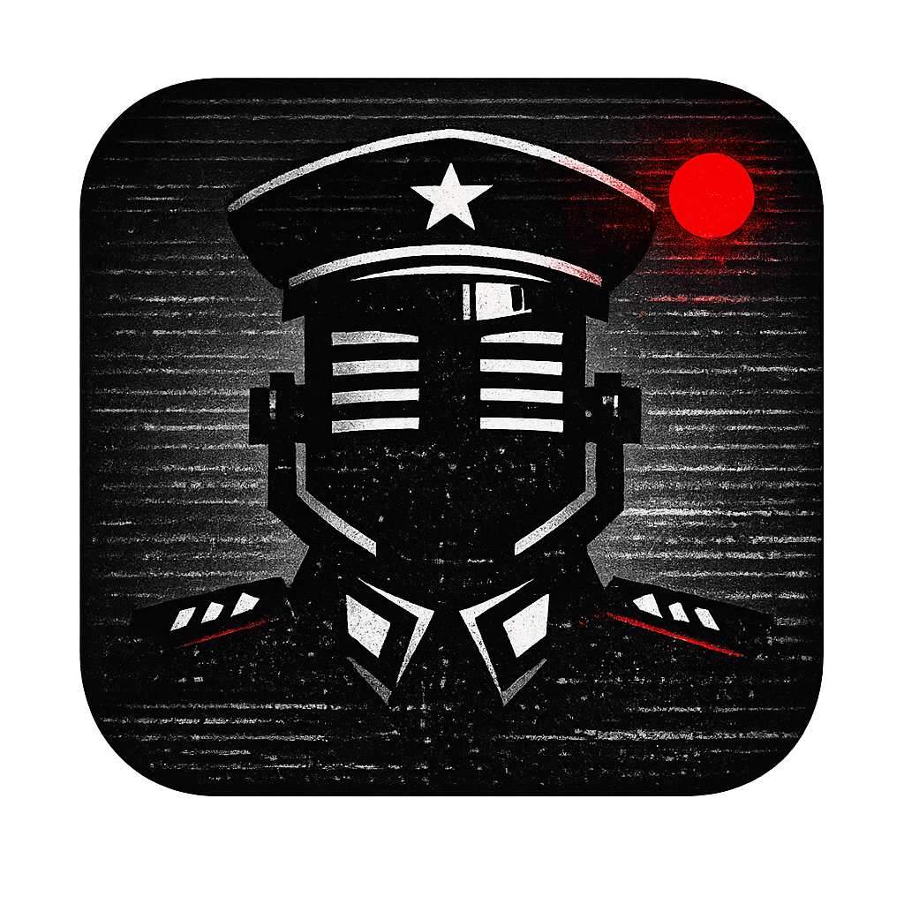

<div align="center">



# The Dictator

**Windows voice dictation app that transcribes speech locally or via cloud, polishes it with AI, and pastes the result directly into any application — all triggered by a single hotkey.**

[](LICENSE)
[](#installation)
[](https://www.electronjs.org/)

</div>

---

<!-- TODO: Replace with actual screenshot or demo GIF -->
<div align="center">

> **Screenshots coming soon** — place a screenshot or GIF of the app in action here.
>
> Suggested: `assets/demo.gif` (recording → transcription → paste flow)

</div>

---

## Features

**Transcription**
- Offline transcription via local Whisper models (tiny → large-v3) — no internet required
- Cloud transcription via OpenAI Whisper API or Groq API
- Automatic model download with progress tracking
- Language support: auto-detect, English, Polish, and more

**AI Post-Processing**
- Clean up, format, and restructure transcribed text with AI
- 3 providers: OpenAI (GPT-4.1), Anthropic (Claude), Ollama (local)
- 5 dictation modes: Voice, Email, Chat, Note, Custom
- Editable system prompts per mode with temperature control

**Workflow**
- Global hotkeys — Toggle or Push-to-Talk recording modes
- Auto-paste into the focused window (character-by-character via Win32 API)
- Clipboard content preserved and restored after paste
- Overlay widgets — Mini (VoiceBar) or Maxi waveform visualizer

**History & Stats**
- Full recording history with SQLite storage
- Audio playback of past recordings
- Stats: total words, total time, recordings count, average WPM

## How It Works

```
┌─────────┐    ┌───────────┐    ┌──────────────┐    ┌─────────┐    ┌───────────┐
│  Hotkey  │───>│  Record   │───>│  Transcribe  │───>│   AI    │───>│  Paste    │
│  Press   │    │  Audio    │    │  (Local/API)  │    │  Polish │    │  Result   │
└─────────┘    └───────────┘    └──────────────┘    └─────────┘    └───────────┘
                                                     (optional)
```

1. Press your hotkey (or hold for Push-to-Talk) — the app captures audio from your microphone
2. Audio is transcribed using a local Whisper model or cloud API
3. Optionally, AI post-processes the text based on your selected dictation mode
4. The result is typed directly into whatever window had focus when you started recording

## Installation

### Download

Go to [**Releases**](https://github.com/kubaasa/the-dictator/releases) and download the latest `.exe` installer.

### Requirements

- Windows 10 or later
- Microphone
- Internet connection (only needed for cloud transcription and AI features — offline mode works without it)

### API Keys (optional)

Cloud features require API keys, which you can configure inside the app:

| Feature | Provider | Where to get a key |
|---------|----------|--------------------|
| Cloud transcription | OpenAI or Groq | [platform.openai.com](https://platform.openai.com/api-keys) / [console.groq.com](https://console.groq.com/keys) |
| AI post-processing | OpenAI | [platform.openai.com](https://platform.openai.com/api-keys) |
| AI post-processing | Anthropic | [console.anthropic.com](https://console.anthropic.com/settings/keys) |

All API keys are encrypted locally using Electron's safeStorage. They never leave your machine except for direct API calls.

## Getting Started

1. **Install and launch** the app
2. **First Run wizard** will guide you through initial setup
3. **Choose your transcription engine** — Local (offline) or Cloud (requires API key)
4. **Pick a dictation mode** — Voice, Email, Chat, Note, or Custom
5. **Press `Ctrl+Space`** to start recording, press again to stop
6. The transcribed (and optionally AI-polished) text is pasted into your active window

### Default Hotkeys

| Action | Shortcut |
|--------|----------|
| Toggle Recording | `Ctrl + Space` |
| Cancel Recording | `Escape` |
| Push-to-Talk | `Ctrl + X` (hold) |
| Show Window | `Ctrl + Shift + D` |

All hotkeys are fully customizable in the Shortcuts page.

## Configuration

### Transcription

| Setting | Options |
|---------|---------|
| Engine | Local (offline) / Cloud (OpenAI Whisper API / Groq) |
| Local model | tiny, base, small, medium, large-v3, large-v3-turbo, distil variants |
| Language | Auto-detect, English, Polish |

### AI Post-Processing

| Setting | Options |
|---------|---------|
| Provider | None / OpenAI / Anthropic / Ollama |
| OpenAI models | gpt-4.1-nano, gpt-4.1-mini, gpt-4.1 |
| Anthropic models | claude-haiku-4-5, claude-sonnet-4-6 |

### Overlay Widgets

| Widget | Size | Description |
|--------|------|-------------|
| VoiceBar (Mini) | 210 x 62 px | Compact 6-bar waveform pill |
| MaxiWidget (Maxi) | 520 x 170 px | Full waveform with timecode, REC indicator, and controls |

Both widgets float above all windows during recording and hide automatically when idle.

## Building from Source

### Prerequisites

- [Node.js](https://nodejs.org/) 18+
- [Git](https://git-scm.com/)
- Windows 10 or later
- C++ build tools — required for native modules (`npm install --global windows-build-tools` or install via Visual Studio Installer)

### Setup

```bash
git clone https://github.com/kubaasa/the-dictator.git
cd the-dictator
npm install
npm run rebuild
```

### Development

```bash
npm start        # Launch in dev mode (Electron Forge + Vite HMR)
npm run lint     # Run ESLint
```

### Build Installer

```bash
npm run make     # Produces NSIS installer in out/make/
```

## Tech Stack

| Layer | Technology |
|-------|------------|
| Framework | Electron 40 |
| Bundler | Vite 6 |
| Frontend | React 19 + Tailwind CSS 4 |
| Language | TypeScript |
| Local STT | @huggingface/transformers (ONNX runtime) |
| Cloud STT | OpenAI Whisper API / Groq API |
| AI | OpenAI SDK, Anthropic SDK, Ollama |
| Database | SQLite via better-sqlite3 |
| Settings | electron-store (encrypted) |
| Hotkeys | uiohook-napi |
| Packaging | Electron Forge (Squirrel/NSIS) |

## Architecture

The app runs in three isolated Electron contexts:

```
┌──────────────────────────────────────────────────────────┐
│                     Main Process                         │
│  (Node.js — full access)                                 │
│                                                          │
│  TranscriptionService   AIService   PasteService         │
│  HotkeyService          HistoryService                   │
│  SecureStorage           UpdateService                   │
├──────────────────────────────────────────────────────────┤
│                     Preload                               │
│  contextBridge → window.dictator API                     │
├──────────────────────────────────────────────────────────┤
│                     Renderer (sandboxed)                  │
│  React UI — no Node.js access                            │
│                                                          │
│  Main Window: Home, Modes, Shortcuts, Widget, History    │
│  Overlay Window: VoiceBar / MaxiWidget                   │
└──────────────────────────────────────────────────────────┘
```

- **Main** — runs all services, manages windows, handles IPC
- **Preload** — exposes a typed `window.dictator` API via `contextBridge`
- **Renderer** — sandboxed React app, communicates with main only through the preload bridge

IPC channel names are centralized in `src/shared/constants.ts`. Types are shared via `src/shared/types.ts`.

## License

[MIT](LICENSE) — Jakub Bruniecki

## Contributing

Contributions are welcome! Feel free to open an issue or submit a pull request.

1. Fork the repository
2. Create a feature branch (`git checkout -b feature/my-feature`)
3. Commit your changes
4. Push to the branch (`git push origin feature/my-feature`)
5. Open a Pull Request
